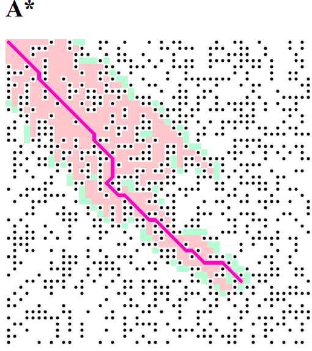

# A-Star-Pathfinding-Algorithm-JS

***This was written in Java Script using the [A Star Search Algorithm](https://en.wikipedia.org/wiki/A*_search_algorithm)***
<p align="center"></p>

***The main concept is to inisiatize an empty list and then keep all the collected dots in it and then check if closed set is empty or not.. and continue this until the openset is empty***
```bash
var openset = [];
var closedset = [];
```
```bash
if(openset.length > 0){
    // we can continue on...
    var winner = 0;
    for (var i = 0; i < openset.length; i++) {
      if (openset[i].f < openset[winner].f) {
        winner = i;
      }
  }
  var current = openset[winner];

  if (current === end) {
      noLoop();
      console.log('DONE!');
  // Best option moves from openSet to closedSet
  }
```
***You will be checking every neighbor and also check for new paths and keep comparing if it is the best path than the earlier one or not... if no path is being found then there is no solution of finding a path leading to the other end of the window***
```bash
// Is this a better path than before?
        var newPath = false;
        if (openset.includes(neighbor)) {
          if (tempG < neighbor.g) {
            neighbor.g = tempG;
            newPath = true;
          }
        } else {
          neighbor.g = tempG;
          newPath = true;
          openset.push(neighbor);
        }


        if (newPath) {                               // Yes its a better path
          neighbor.h = heuristic(neighbor, end);
          neighbor.f = neighbor.g + neighbor.h;
          neighbor.previous = current;
        }
      }
    }

  } else {                                            // Uh oh, no solution
    console.log('no solution');
    noLoop();
    return;
```
***And simulataneously we will be drawing the current state - the grid and the path contineously***

***Rest of the code is also easily stated with comments for better understanding and the Dot.js works for the neighbor checking and the grid functioning.***


